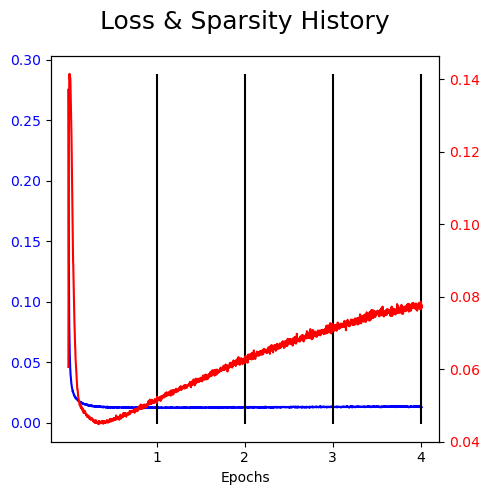
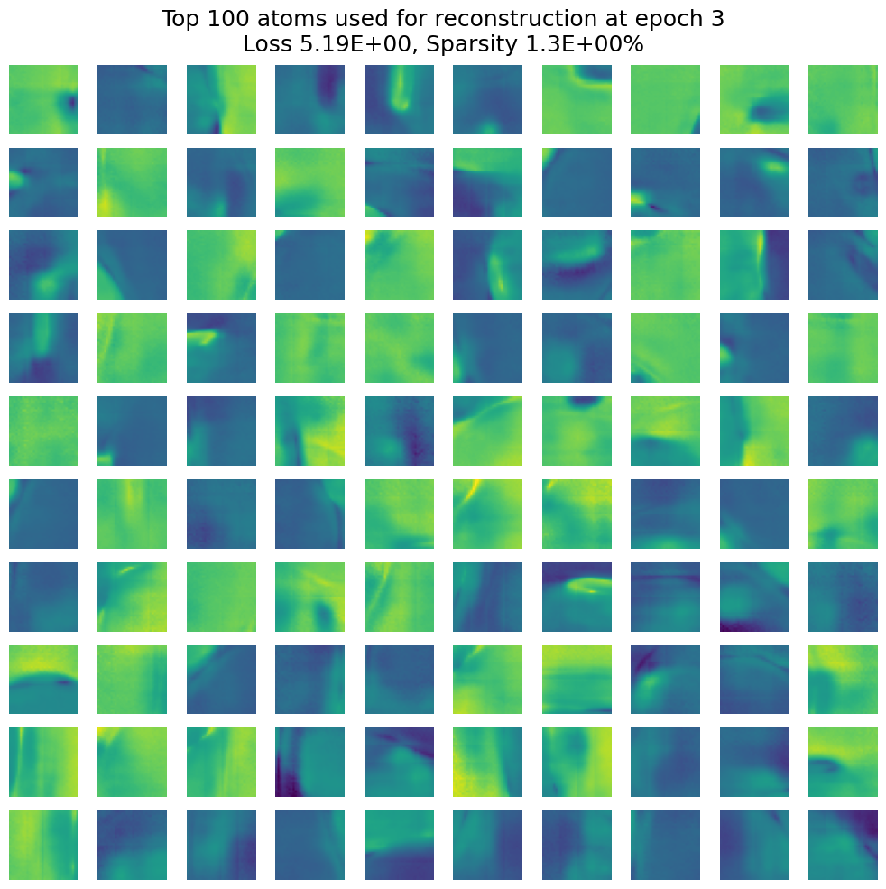
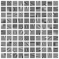
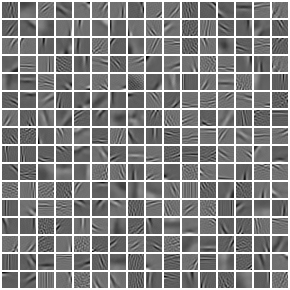
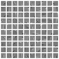

# About
All day, every day we unconsciously segment 
the world into tidy pieces.

From distinguishing and identifying elements 
of the physical space around us to breaking 
down abstract ideas into something more 
familiar-- decomposition on all planes of conception is fundamental to our brains.

In mathematical signal processing we use a wide variety of approaches to replicating this automatic decomposition in computer programs.
There are techniques that simply separate components along axes of highest variation amongst (eg 
Principal Component Analysis), and there are nonlinear techniques that seek to parameterize 
these axes so as to  pull out interpretable components (like [Morphological 
Component Analysis](https://arxiv.org/abs/2208.06056)). There are more explicit approaches like 
mathematically beamforming data streams in order to isolate different source signals, and there are 
more implicit ones like training self-supervised neural networks to encode latent axes of 
interest as they see fit.

Welcome to my personal PyTorch library for exploring some of these concepts (and to host
unit-tested code for reproducing results
from [my PhD thesis](https://www.proquest.com/openview/6821866ac2a973b555473b2376dc61f3/1?pq-origsite=gscholar&cbl=18750&diss=y)).

Some tools herein:
- dictionary learning
- differentiable convex optimization algorithms (AKA "unrolled" learnable encoders, e.g. [LISTA](https://icml.cc/Conferences/2010/papers/449.pdf),  [LSALSA](https://arxiv.org/abs/1802.06875))
- Variational Autoencoder
- some Python wrappers for SQL

Tools I'm working on:
- morphological component analysis tools
- [Beyond Backprop](https://arxiv.org/abs/1806.09077) style layer-parallelized training

[//]: # (## Some preliminary visualizations)

[//]: # (
)

[//]: # ( )

[//]: # (  )

[//]: # (
)

# Formal Sparse Coding Background
It is often useful to represent a signal or image in terms of its basic building blocks.
For example, a smiley-face can be efficiently described as "a circle, two dots, and a curve".
At least, that is more efficient than "pixel 1: value 0.1. Pixel 2: value 1" and so on for 
thousands or millions of pixels.
This is a toy example of "sparse representation"-- i.e., if we have a *dictionary* of shapes and 
curves, 
we can often describe an image as a weighted-sum of those dictionary elements. The fewer the number of dictionary atoms used, 
the more efficient or *sparse* the representation is. With a list of dictionary atoms we can 
then write the corresponding list of weights (or coefficients), this list is a vector called the 
code. Codes are specific to dictionaries, and when they are mostly zeroes, we call them *sparse*.

*Sparse coding* is the problem of generating a dictionary and set of corresponding codes for a 
dataset. The idea that, since the  codes will share a common "language" via the dictionary, it 
can be represented more efficiently than the original dataset. You can also take a look at which 
dictionary atoms are most important, which circle back to signal decomposition as discussed above.

This repository provides some tools and classes for various sparse coding experiments.
As of now, the focus is on learning a linear dictionary (e.g. for vectors, including vectorized image patches) from data.
The training process yields a dictionary-- i.e. a matrix, whose rows are the dictionary elements-- which can be used along with a sparse code to represent a signal.

CIFAR-, ASIRRA-, and Fashion-MNIST-based atoms, with patch-sizes 10x10, 16x16, and 10x10, 
respectively.

This procedure is originally described in "Emergence of simple-cell receptive field properties by learning a sparse code for natural images", by Olshausen and Field [Nature, 381:607–609, 1996](https://www.nature.com/articles/381607a0).
It is famously used in "Learning Fast Approximations of Sparse Coding" (Gregor and Lecun), which 
inspired more recent papers, i.e.
* "LSALSA: efficient sparse coding in single and multiple dictionary 
settings" ([Cowen, Saridena, Choromanska](https://arxiv.org/abs/1802.06875))
* "Approximate extraction of late-time returns via morphological component analysis" ([Goehle, 
  Cowen, et al.](https://arxiv.org/abs/2208.06056))
* "Phenomenology Based Decomposition of Sea Clutter with a Secondary Target Classifier" ([Farschian, Cowen, Selesnick](https://ieeexplore.ieee.org/abstract/document/10149773))
* "Joint Sparse Coding and Frame Optimization"  ([Goehle, Cowen](https://ieeexplore.ieee.org/document/10382582))

We train by minimizing
with respect to the matrix/dictionary/decoder 
:

where

 is a scalar parameter that balances sparsity with reconstruction error,

 is the dictionary,

is the p-th training data sample, and

is its corresponding _optimal sparse code_.

What do we mean by optimal sparse code? And why would we optimize an L1 term that does not include

(hence giving a zero subgradient)? The procedure is as follows.
1. Select a batch of image patches (or whatever training data): 
2. Compute optimal codes for each .
How? Fix .
With fixed , 
is convex with respect to !
So, we compute the argument-minimimum with respect to ,
to obtain an optimal code. We call  
the optimal code of ,
given the current dictionary. In this repo we compute optimal codes using an algorithm called FISTA.
Note: 
depends on 
,
but it does *NOT* depend on the algorithm used to encode ,
since it is a convex problem with a unique solution) 
3. Next, we un-fix , compute the gradient of 
with respect to 
and perform backpropagation using the batch. 
4. Re-normalize the columns of .
5. Go back to Step 1 and pull out a fresh batch, unless  has converged.

In summary, we do not couple the problems of sparse coding (producing codes) and training a decoder (a.k.a. dictionary). Rather, we iterate between them.

After successful optimization, the following should hold:

for .

In other words, the sparse vector 
multiplied with the (learned) dictionary 
provides an efficient approximation to the signal .

[//]: # (### TO-DO)

[//]: # (* save dictionary objects)

[//]: # (* put lua version on &#40;maybe...&#41;)

[//]: # (* color version)

[//]: # (* training script for encoders)

[//]: # (* re-formulate "learned FISTA")

[//]: # (* look into SSNAL &#40;see past team emails&#41;)

[//]: # (* C++ Tensorflow framework....!)

[//]: # ()

